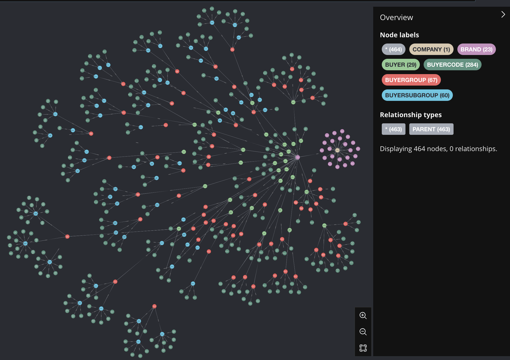
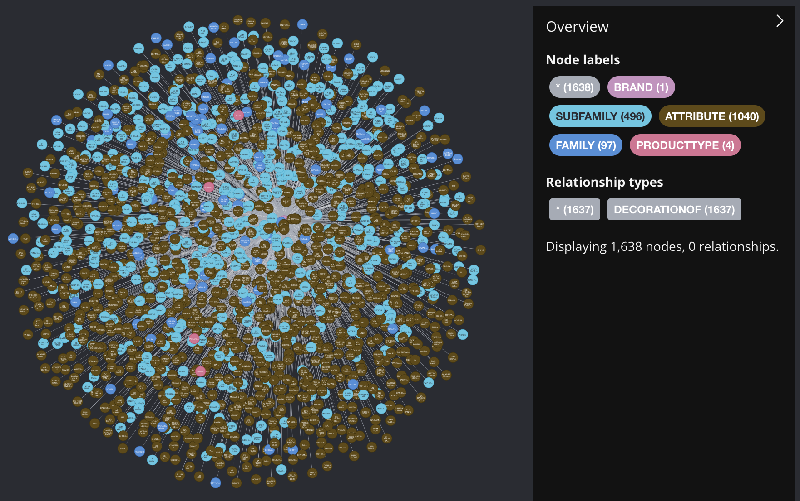
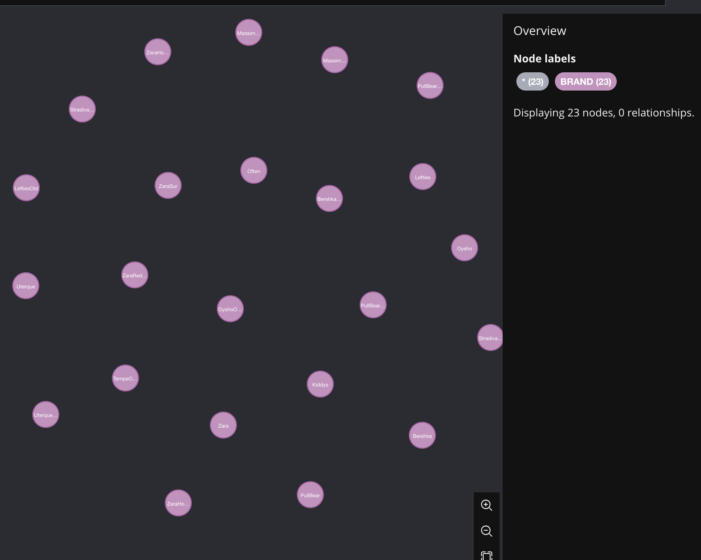
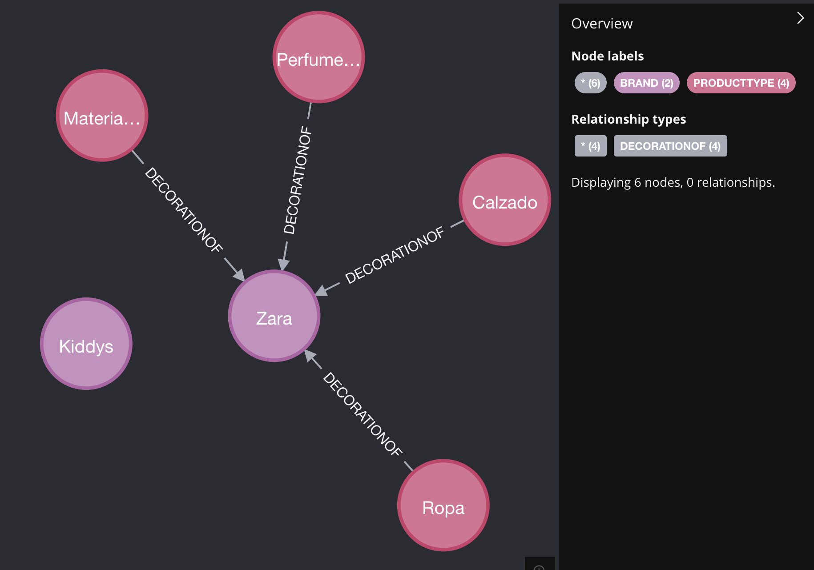
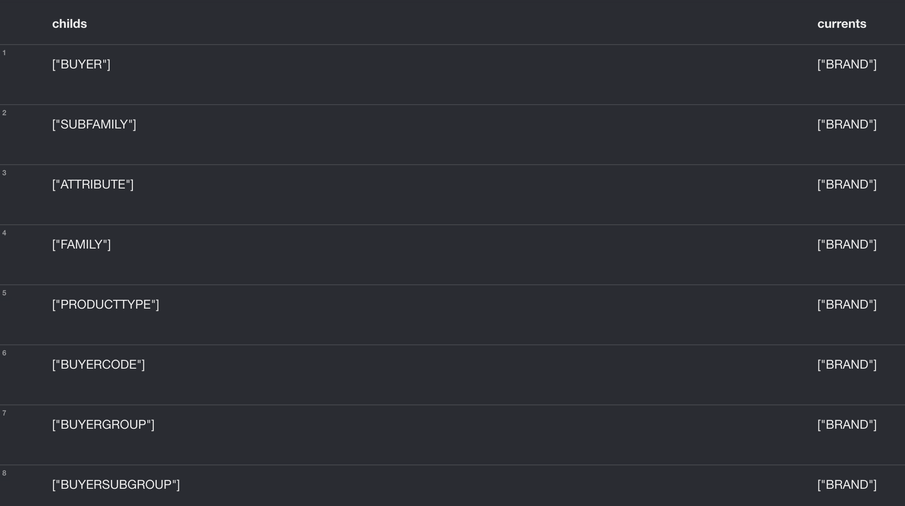
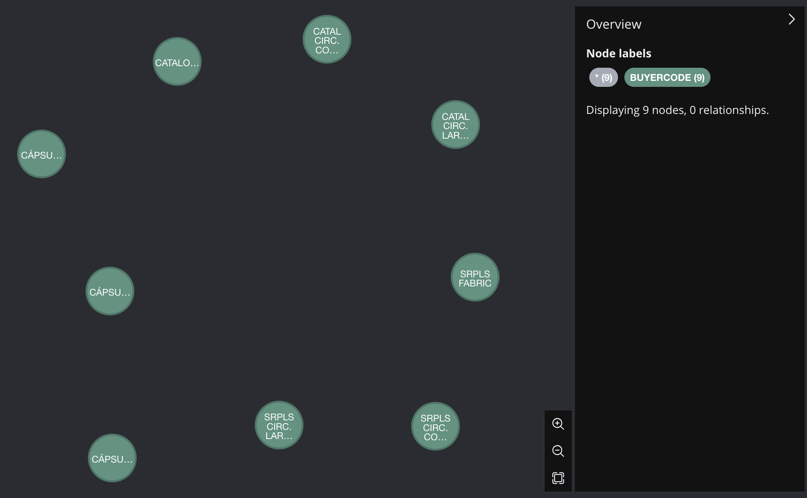
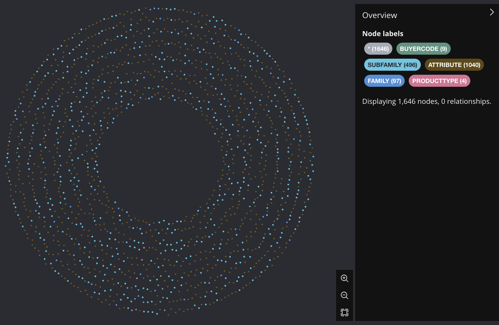
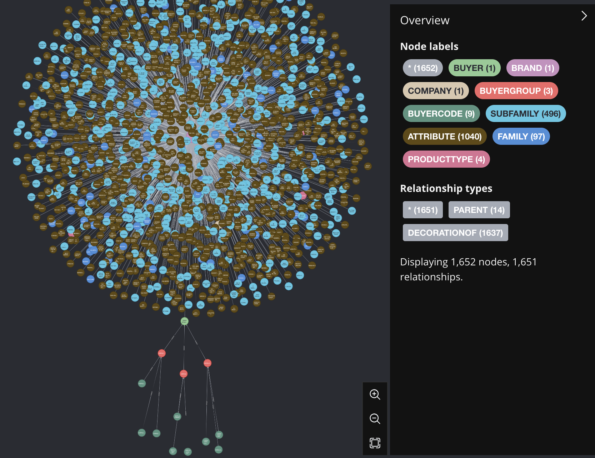
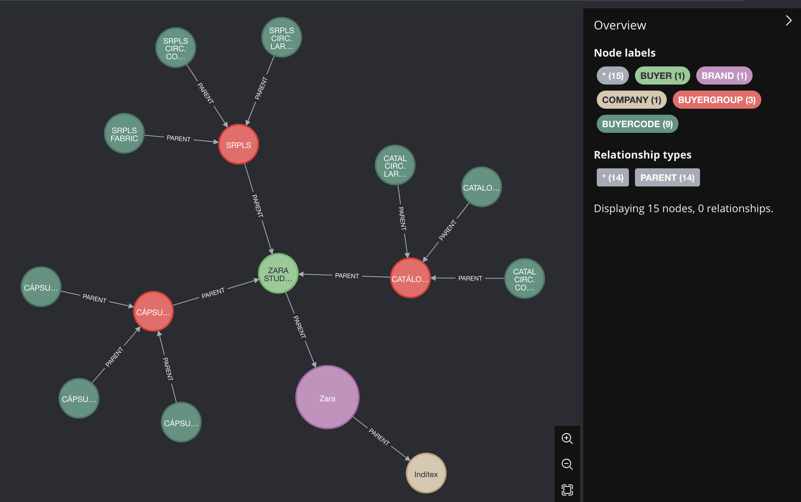

# Purchase Categories

## 📜 Summary

Purchase Categories tries to resolve the problem of using a specific business language and it's hierarchies.

The idea behind is to work with dynamic filters and call this services to know what you should print and how to filter, dimension, and structure the data.

You also can attach the scope vision of the users, with authorization services or config.

There should be no service with semantic ITX language structure or hardcoded data, things such _attributes, families_ and any other thing out of IOP language.

In this Service you should be able to retrieve any kind of category that contains a close to static state and it is never created in the IOP process.

## 🚀 Getting started

Understand the concepts and play around with the API in order to get the values that you need

## About

This api Rest tries to cover all the uses cases that all the BFF and BC needs in order to manage structure and language that they shouldn't know.

- All the BFFs should be able to retrieve the hierarchy data with the category types in order to provide the user where they are, or walks through the structure.
- All the BC should be able to retrieve leafs in order to use it to store the categories, and filter when they want to retrieve some data.
- This also works for the informational services, to be able to dimension and filter using the __CategoryTypes__ and __Hierarchies__.

### Main Goal

This API tries to manage the business hierarchy and language as data, preventing to use it as data structure for each entity or couple the filters or frontends to a specific language that should be dynamic.

### Context

In Purchase Categories we work with _two_ types of entities:

- __Category__: this should be something fully relates with some business thing, that point to something understandable by the users. Each category is described by three attributes:

  - _urn_: urn that identify the specific Category.
  - _name_: this should be the known name of the category.
  - _type_: the type of that category.

- __Type__: this works as a label, each category should have at least one type, this type can contain any kind of language, IOP or business related, but should be something familiar to the business users. Each type is described by three attributes:

  - _name_: name of the type.
  - _description_: description of the grouping, this should be used to provide some context for the final users.

All the categories are linked using two different types of relations:

- __PARENTING__: These relations are used to define hierarchies, this follows some rules:

  - One Category can only have one parent, but multiple childs, this will create a tree.
  - All children of one Category should have the same type, in order to be consistence with the data structures.

- __DECORATION__: These relations are used to provide with more context or filters to a category, this follows some other rules:

  - The decorator category can not have hierarchy
  - One decorator can decorate to multiple Categories
  - Category decorators are inheritance to the childs.

### Specifics

RestFull API to provide the data

## Usage

The authorization phase should be done in the BFF, so all our data is not authorize, if you request the data, you can reach any structure data.

There is no sensitive data in this service, it is all about hierarchies and categories, it contains the business language but not business data.

### Configuration

Just get the token to access the service and test it!

### Use Cases

There is multiple uses cases that this API will cover

#### How can I fulfill my combos?

There is multiple ways to get this information, this will differ in the behaviour that you want in your application.
The normal way you request this information is calling to hierarchies endpoint sending your users heindall category info as root:

In this scenario your use has access to `urn:Buyer:59674c20-a7ca-477c-a7a2-c8edd5021f16` buyer, this is `PUNTO` Buyer.

`GET serverEndpoint/V1/categories/hierarchies?urn=urn:Buyer:59674c20-a7ca-477c-a7a2-c8edd5021f16`:

```json
[
  {
    "category": {
      "urn": "urn:buyer:de7fe3ce-f550-5432-8ff5-9aa8a8605f3c",
      "type": "buyer",
      "description": "PUNTO"
    },
    "parent": {
      "category": {
        "urn": "urn:section:de7fe3ce-f550-5432-8ff5-9aa8a8605f3c",
        "type": "section",
        "description": "Caballero"
      },
      "parent": {
        "category": {
          "urn": "urn:product:de7fe3ce-f550-5432-8ff5-9aa8a8605f3c",
          "type": "product",
          "description": "Ropa"
        },
        "parent": {
          "category": {
            "urn": "urn:brand:de7fe3ce-f550-5432-8ff5-9aa8a8605f3c",
            "type": "brand",
            "description": "Zara"
          }
        }
      }
    },
    "child": [
      {
        "category": {
          "urn": "urn:buyerGroup:de7fe3ce-f550-5432-8ff5-9aa8a8605f3c",
          "type": "buyerGroup",
          "description": "B.COLECCIÓN B"
        },
        "child": [
          {
            "category": {
              "urn": "urn:buyerCode:de7fe3ce-f550-5432-8ff5-9aa8a8605f3c",
              "type": "buyerCode",
              "description": "B.COLECCIÓN B CORTO"
            },
            "child": [],
            "decorator": []
          }
        ],
        "decorator": []
      },
      {
        "category": {
          "urn": "urn:buyerGroup:de7fe3ce-f550-5432-8ff5-9aa8a8605f3c",
          "type": "buyerGroup",
          "description": "CIRCULAR DENIM"
        },
        "child": [],
        "decorator": []
      }
    ],
    "decorator": [
      {
        "category": {
          "urn": "urn:family:de7fe3ce-f550-5432-8ff5-9aa8a8605f3c",
          "type": "family",
          "description": "CAMISETA"
        }
      },
      {
        "category": {
          "urn": "urn:atributte:de7fe3ce-f550-5432-8ff5-9aa8a8605f3c",
          "type": "atributte",
          "description": "BO"
        }
      }
    ]
  }
]
```

If you go through this hierarchy, you should be able to print for the users all the categories that he is able to see, and even the relation between that categories
so if your user clicks on one category you do not have to call again the endpoint.

Maybe you have to get all the inditex tree, in this scenario there is too much information to send to the client, so maybe it is better to call it by labels.

If you want to get the label that a user can see you can call again using the heindall category of your user:

We are using the same category `urn:Buyer:59674c20-a7ca-477c-a7a2-c8edd5021f16` buyer, this is `PUNTO` Buyer.

`GET serverEndpoint/V1/categories/types?urn=urn:Buyer:59674c20-a7ca-477c-a7a2-c8edd5021f16`:

```json
{
  "urn:Buyer:59674c20-a7ca-477c-a7a2-c8edd5021f16": [
    {
      "id": "buyer",
      "name": "Buyer",
      "description": "Group the buyer of some sections under in a given branch"
    },
    {
      "id": "section",
      "name": "Section",
      "description": "Grouping into which each brand is divided according to the target audience of the products it sells. The sections are: women, men and kids."
    },
    {
      "id": "productType",
      "name": "productType",
      "description": "Product types that this branch sells, in case of Zara:  Clothes, Shoes, Perfume"
    },
    {
      "id": "buyerGroup",
      "name": "Buyer Group",
      "description": "Buyer Group subdivision for buyers"
    },
    {
      "id": "buyerCode",
      "name": "Buyer Code",
      "description": "The specific buyer code"
    },
    {
      "id": "family",
      "name": "family",
      "description": "Group articles by type such as Jeans, Jackets.."
    },
    {
      "id": "attribute",
      "name": "Attribute",
      "description": "some specification details for articles, like shorts, raw materials.."
    }
  ]
}
```

Then, using this labels, you can call the _categories_ endpoint in order to get the categories filter by label.
This can also help, if you already know the category type you want to ask for.
__NOTE__: It is important to remember that should not be any kind of inditex language in the IOP code, so all of these labels relates to inditex language should be store as config.

We are using the same category `urn:Buyer:59674c20-a7ca-477c-a7a2-c8edd5021f16` buyer, this is `PUNTO` Buyer and filtering by a `Family` type.

`GET serverEndpoint/V1/categories?urn=urn:Buyer:59674c20-a7ca-477c-a7a2-c8edd5021f16&categoryType=Family`:

```json
[
  {
    "category": {
      "urn": "urn:family:de7fe3ce-f550-5432-8ff5-9aa8a8605f3c",
      "type": "family",
      "description": "CAMISETA"
    }
  }
]
```

As you can see, it is the same family that you would get using hierarchies, but you will need to run multiples request to get the same information.

#### I'm creating a entity and i would like to have all the categories that can be attached to this entity

Maybe you are going to create a new product, or a new collection, or another kind of entity. In order to be able to get all the categories for the user,
you can call leaf endpoint, as always you can send the heindal user category to filter:

We are using the same category `urn:Buyer:59674c20-a7ca-477c-a7a2-c8edd5021f16` buyer, this is `PUNTO` Buyer.

`GET serverEndpoint/V1/categories/leaf?urn=urn:Buyer:59674c20-a7ca-477c-a7a2-c8edd5021f16`

```json
[
  [
    {
      "urn": "urn:family:de7fe3ce-f550-5432-8ff5-9aa8a8605f3c",
      "type": "family",
      "description": "CAMISETA"
    },
    {
      "urn": "urn:buyerCode:de7fe3ce-f550-5432-8ff5-9aa8a8605f3c",
      "type": "buyerCode",
      "description": "B.COLECCIÓN B CORTO"
    },
    {
      "urn": "urn:atributte:de7fe3ce-f550-5432-8ff5-9aa8a8605f3c",
      "type": "atributte",
      "description": "BO"
    },
    {
      "urn": "urn:buyerGroup:de7fe3ce-f550-5432-8ff5-9aa8a8605f3c",
      "type": "buyerGroup",
      "description": "CIRCULAR DENIM"
    }
  ]
]
```

In resume, this endpoint will return all the leafs and decorators that a given node have.

#### I would like to get the Campaigns

If you want to get the all the campaigns you can call the categories endpoint and filter by campaign:

`GET serverEndpoint/V1/categories?categoryType=campaign`

```json
[
  {
    "category": {
      "urn": "urn:campaign:de7fe3ce-f550-5432-8ff5-9aa8a8605f3c",
      "type": "Campaign",
      "description": "I23"
    }
  },
  {
    "category": {
      "urn": "urn:campaign:te7fe3ce-f550-5432-9dt1-9aa8a8605f3r",
      "type": "Campaign",
      "description": "V24"
    }
  },
  {
    "category": {
      "urn": "urn:campaign:ce7fe3ce-9dt1-5432-8ff5-9aa8a8605f3b",
      "type": "Campaign",
      "description": "I24"
    }
  }
]
```

For the moment, we do not have information about __current campaigns__ or __equivalent campaigns__.
In future iterations (before MVP), we will cover __equivalents campaigns__.
__Current Campaigns__ will be out of scope for the time being.

### Example

The content of the Categories Data is based on Masters tables, every category should be something relates with ITX language.
A category should be a concept of something static that is not created in the IOP process, __it should be something common enough__.

The types of categories between which compatibilities and relationships will be established are as follows:

- COMPANY (i.e. Inditex)
- BRAND (i.e. Zara)
- PRODUCTTYPE (i.e. Ropa)
- SECTION (i.e. Caballero)
- BUYER (i.e. Global)
- BUYERGROUP (i.e. Atemporary)
- ATTRIBUTE (i.e. Camisería Colección)
- SECONDARY_ATTRIBUTE (i.e. )
- FAMILY (i.e. Pantalón)
- SUBFAMILY
- OUTSOURCINGTYPE [NEARSHORE, ONSHORE, OFFSHORE]
- BUYERCODE
- CONTRIBUTIONTYPE [BASIC, FANTASY]
- SEASON (i.e. V2023, I2024)

The first approchar will be import Zara_1 hierarchy information, having something like this:



Then we will decorate the brand node with all the Families, Subfamilies and attributes:



With the graph, who this API works in a visual way?

- _/categories/brand_ will return all the brands loaded in categories:



- _/categories/brands/products/_ will return a map with products of the given brands:

in the example we are asking for Zara and Kiddys brand prodcuts



- _/categories/types_ will return a map with the category types of the given nodes, that means, given a node return all the types that can apply to this category:

in the example we are asking for Zara brand to get all the category types



- _/categories_ will return a list of categories relates to a specific category with the given type:

in the example we are asking for Zara Studio BUYER and want all the BUYERCODES



- _/categories/leaf_ will return the list of leaf categories relates to a specific category:

in the example we are asking for Zara Studio BUYER and want all the BUYERCODES



- _/categories/hierarchy_ This should be the most common one, given a list of cateories, it will return the hierarchy for each category:

in the example we are asking for Zara Studio BUYER and want the hirearchy



For a better understading, this picture removes the decorators to show the apropiate structure:



## 🧰 Support

Add a link to the support section in the product's documentation. If no documentation exists yet, make sure you specify how users can contact you/the team.

## Documentation

We create a local [playground](https://github.com/inditex/app-icbcpurent/tree/develop/apis/playground) in order to let you understand the graph and the information that we have under the service.
