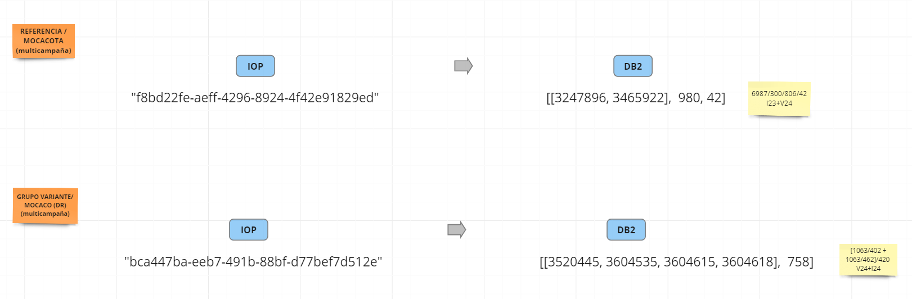

#### Title: Entity ID Translation API

#### Abstract:
This document describes an API for translating entity IDs between different systems. The API is designed to be used by projects who need to integrate multiple systems that use different entity ID formats.

#### Motivation:
Many organizations use multiple systems that have different entity ID formats. This can make it difficult to integrate these systems and share data between them. An API for translating entity IDs between different systems can help to solve this problem.

#### Specification:
The Entity ID Translation API should support the following operations:

1. Translate an entity ID from one system to another.
2. Retrieve a list of supported translation mappings including supported entity ID formats.

Different systems use different formats for entity IDs. For example, some systems may use a simple integer ID, while others may use a more complex format that includes letters, numbers, and special characters
The data type of an entity ID can also vary depending on the system. For example, an entity ID may be represented as a string, an integer, or a UUID. In some cases, entity IDs may be composed of multiple identifiers. For example, an entity ID may include a prefix that identifies the type of entity, followed by a unique identifier for that entity. This can help to ensure that entity IDs are unique across different systems.

Some examples of translations that must be supported:

Single value identifier to single value changing data type

Single value identifier to composed identifier including multivalued component

